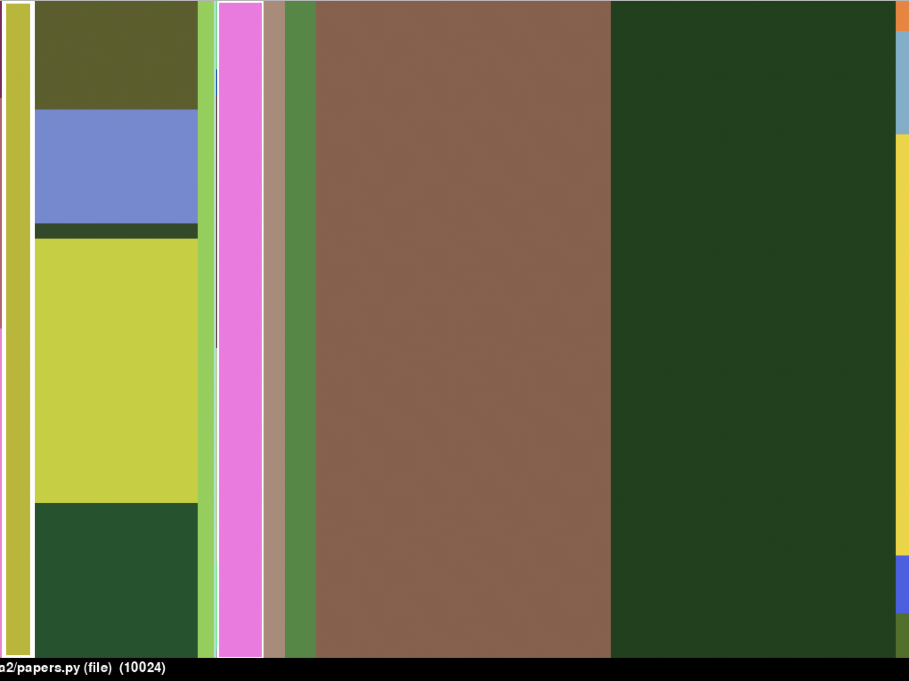

# TreeMap

This project gives a graphical interactable representation of the amount of space files occupy inside the folder of the mentioned path.
 

 
 
The main options are :-
 
<code>
  press "a" to open up all the folders to files level and then check the space occupied. 
  press "c" to close all the files to just the folder level. 
  press "e" to open the folder one level at a time. 
</code>
The path is also given at the bottom of the window.

<h4>Requirements</h4>

You need to have an Integrated Development Environment specially for python and for this project, I used PyCharm.

<h4>Authors</h4>
Aditya Goyal and Parth Patel.
